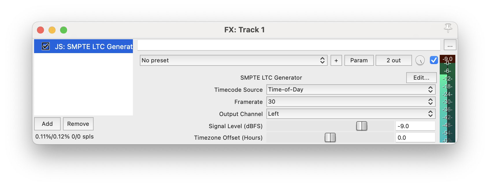

# Timecode Generator for Reaper

  

This JSFX script generates a SMPTE linear timecode audio signal that can be fed into video cameras which do not support timecode natively. The timecode can then be extracted from the audio track by video editing software such as Davinci Resolve.

  

  
  

## Features

- Time-of-Day and Project Time as timecode source

- Framerate: 23.97 / 24 / 25 / 29.976 DF / 30

- Output channel

- Gain adjustment

- Timezone offset

  

## Installation

  

Copy the .jsfx file to your Reaper scripts directory. From [@reaperblog](https://reaper.blog/2015/06/quick-tip-how-to-install-js-plugins/):

  

> After downloading a JS plugin, add the files into the Effects folder of REAPER’s resource folder, then scan for new plugins.

> You can quickly find the resource folder from REAPER in the options menu, “Show REAPER’s resource path in explorer/finder…”

  

## Usage

  

Add the FX to an empty track. You will probably want to disable routing to the Master and instead use a specific Hardware Output to avoid hearing the sound.

